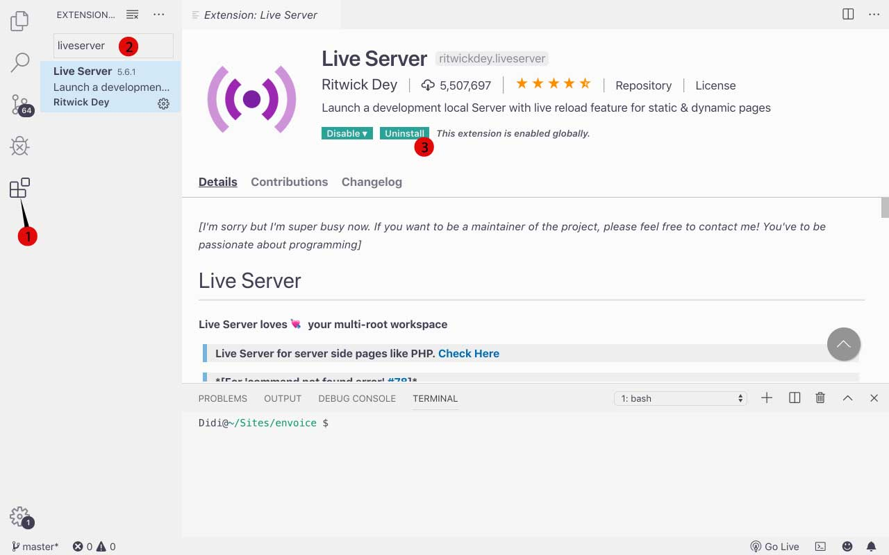

# Installfest

Congratulations!!! You made this far. 
Before We get started lets install a few things:

## Code Editors
- [Visual Studio Code (recommended)](https://code.visualstudio.com/download)
- [Atom (optional)](https://atom.io)

## LiveServer Plugin
- Install Visual Studio Code
- Start Visual Studio Code
- Follow the image below to install `Liveserver plugin`

## Github Desktop
- [Github Desktop](https://desktop.github.com)

## Web Browser
We will be using Google Chrome for this class
- [Google Chrome](https://www.google.com/chrome/)

## Slack
Slack is used for communication with students, instructional Team and GA
- [Slack](https://slack.com/intl/en-gb/downloads/mac?geocode=en-gb)
